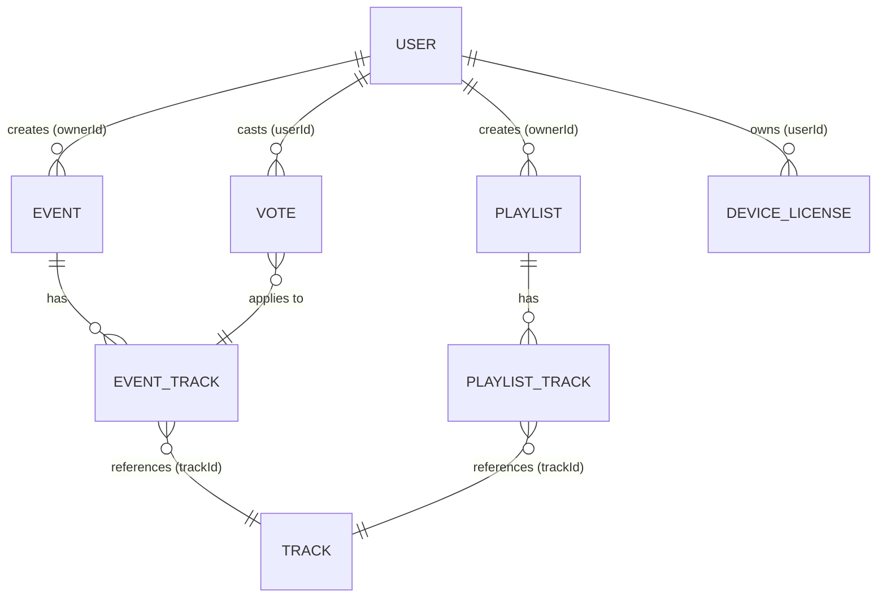

# API Contract & Models para Music Room

Un resumen del contracto de la API y los data models. Esto lo tengo que discutir con mi companero que hará el backend en SQL para que estar alineados.

## 1. Auth Strategy (Autenticación)
Vamos a usar JWT (JSON Web Tokens). El flow:
* Soportaremos login con **Email/Password**, **Google** y **Facebook**.
* La app en Flutter manda las credenciales o el social token al backend.
* El backend de mi companero valida los datos y me regresa un JWT firmado.
* En Flutter, yo guardo ese JWT usando `flutter_secure_storage`.
* Para todos los requests futuros, configuro dio (REST clasico) con un interceptor para inyectar el token en el header `(Authorization: Bearer <token>)`.

## Data Models (Estructura para SQL y Dart)
Estos son los modelos principales que necesitamos en la DB y que yo mapearé en Flutter:

* User (Usuario):
  * id (UUID)
  * email (String)
  * displayName (String)
  * publicInfo (String) - Info pública.
  * privateInfo (String) - Info privada.
  * musicPreferences (List<String>) - Preferencias musicales.

* Event / Room (Para el Music Track Vote):
  * id (UUID)
  * name (String)
  * isPublic (Boolean) - Visibility management.
  * ownerId (UUID - Relación con User)

* Playlist (Para el Music Playlist Editor):
  * id (UUID)
  * name (String)
  * isPublic (Boolean) - Visibility management.
  * ownerId (UUID - Relación con User)

* Track (Canción):
  * id (String - Puede ser de Spotify/YouTube)
  * title (String)
  * artist (String)
  * votes (Integer - Votos en vivo)

### Explicación de las Referencias (Foreign Keys)

- **OwnerId:** Tanto `EVENT` como `PLAYLIST` tienen un `ownerId` que es una Foreign Key (FK) apuntando al `id` del `USER`. Así sabemos quién tiene los permisos de admin sobre ese cuarto o playlist.
    
- **Tablas Intermedias (Junction Tables):** No podemos meter canciones directamente al evento porque una canción tiene su propia info (título, artista) y en un evento tiene un "estado" (cantidad de votos). Por eso existen `EVENT_TRACK` y `PLAYLIST_TRACK`.
    
- **Track:** El `id` de la tabla TRACK idealmente será el ID de Spotify o YouTube.

---

## Blind Spots (Cosas que faltaban y debemos considerar)

1. **Delegation & Licenses (`DEVICE_LICENSE`):**
    
    - _El problema:_ El PDF pide "Music Control Delegation" y dice que el license management debe ser específico para cada _dispositivo_ ("each device attached to the user's account").
        
        
2. **Ordenamiento en Playlists (`PLAYLIST_TRACK`):**
    
    - _El problema:_ En un "Playlist Editor", el orden de las canciones importa.
        

---

## Data Models (Estructura Actualizada para SQL y Dart)

- **User:** `id`, `email`, `displayName`, `publicInfo`, `privateInfo`, `musicPreferences`
    
- **Device / License (NUEVO):** `id`, `userId` (FK), `deviceId`, `deviceType` (iOS/Android), `canControlMusic` (Boolean)
    
- **Event:** `id`, `name`, `isPublic`, `ownerId` (FK)
    
- **Playlist:** `id`, `name`, `isPublic`, `ownerId` (FK)
    
- **Track:** `id` (Spotify ID), `title`, `artist`, `duration`
    
- **Event_Track (Estado en vivo):** `eventId` (FK), `trackId` (FK), `voteCount`
    
- **Vote (NUEVO - Seguridad):** `userId` (FK), `eventId` (FK), `trackId` (FK)
    

---

## 5. Endpoints de la API REST (Update)

| **Method** | **Endpoint**          | **Purpose**       | **Request Body**                                                | **Expected Response**                                      |
| ---------- | --------------------- | ----------------- | --------------------------------------------------------------- | ---------------------------------------------------------- |
| POST       | `/auth/register`      | Sign up           | `{ "email": "...", "password": "...", "deviceId": "..." }`      | `{ "user": {...}, "token": "..." }`                        |
| POST       | `/auth/login`         | Sign in           | `{ "email": "...", "password": "...", "deviceId": "..." }`      | `{ "user": {...}, "token": "..." }`                        |
| POST       | `/events`             | Create live event | `{ "name": "Party", "isPublic": true }`                         | `{ "event": {...} }`                                       |
| GET        | `/events/{id}/tracks` | Get event tracks  | _(Empty)_                                                       | `[ { "track": {...}, "voteCount": 5, "hasVoted": true } ]` |
| POST       | `/events/{id}/vote`   | Vote for track    | `{ "trackId": "t1" }`                                           | `{ "success": true, "newVotes": 6 }`                       |
| POST       | `/devices/delegate`   | Dar control       | `{ "targetUserId": "...", "deviceId": "..." }`                  | `{ "success": true }`                                      |
| POST       | `/logs`               | Security logs     | `{ "platform": "iOS", "device": "iPhone", "version": "1.0.0" }` | `{ "success": true }`                                      |
