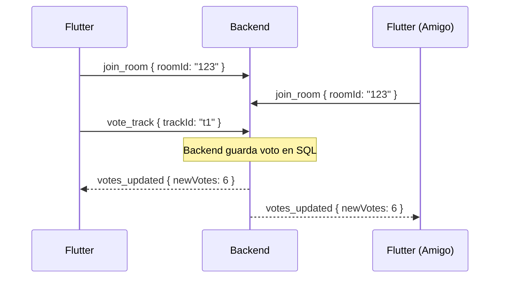

## 1. Conexión y Seguridad

Vamos a usar WebSockets (idealmente **Socket.io**) para las funciones en vivo.

El flow:

* REST lo usamos para cosas estáticas (login, crear el evento)
* Cuando el usuario entra a la pantalla del evento/playlist, Flutter abre la conexión WS.
* En el handshake inicial, Flutter manda el JWT.
* Usaremos el concepto de "Rooms" de Socket.io para agrupar usuarios por `eventId` o `playlistId`.

## 2. Estructura para Backend y Flutter

Estos son los eventos clave que enviaremos y recibiremos basicos.

### A. Gestión de Salas (Rooms)

| Flutter Emite (Client -> Server) | Payload | Acción del Backend |
| :--- | :--- | :--- |
| `join_room` | `{ "roomId": "UUID", "type": "event|playlist" }` | Une el socket al room y envía estado inicial. |
| `leave_room` | `{ "roomId": "UUID" }` | Saca el socket del room. |

### B. Music Track Vote (Votación en Vivo)

El PDF pide "Live music chain with vote".

| Flutter Emite | Payload | Backend Broadcasts (Server -> Clients) | Payload Recibido |
| :--- | :--- | :--- | :--- |
| `vote_track` | `{ "trackId": "t1", "roomId": "UUID" }` | `votes_updated` | `{ "trackId": "t1", "newVotes": 6 }` |
| `suggest_track` | `{ "trackId": "t2", "roomId": "UUID" }` | `track_added` | `{ "track": {...}, "votes": 0 }` |

### C. Music Playlist Editor (Edición Real-Time)

El PDF pide "Real time multi-user playlist edition"

| Flutter Emite | Payload | Backend Broadcasts | Payload Recibido |
| :--- | :--- | :--- | :--- |
| `add_to_playlist` | `{ "trackId": "t2", "roomId": "UUID" }` | `playlist_updated` | `{ "action": "add", "track": {...} }` |
| `remove_from_playlist`| `{ "trackId": "t1", "roomId": "UUID" }` | `playlist_updated` | `{ "action": "remove", "trackId": "t1" }` |
| `move_track` | `{ "trackId": "t2", "newPosition": 1, "roomId": "UUID" }`| `playlist_updated` | `{ "action": "move", "trackId": "t2", "newPos": 1 }` |

